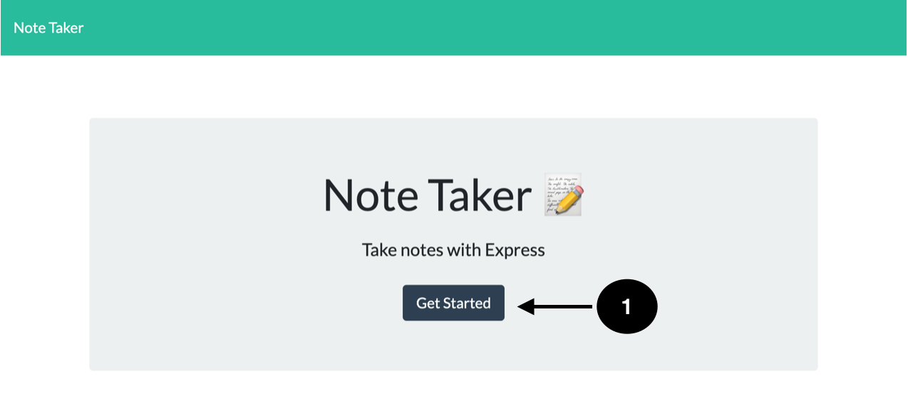
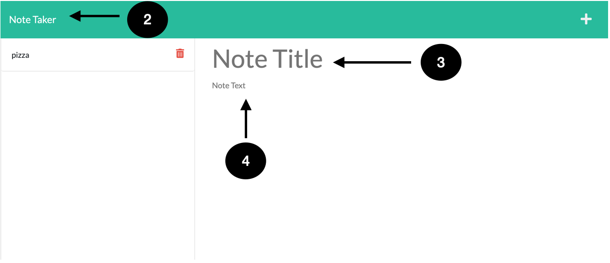
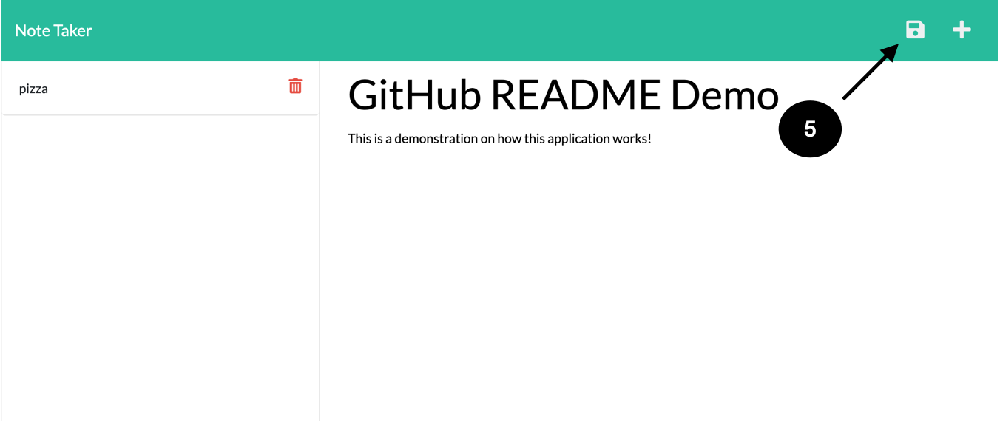
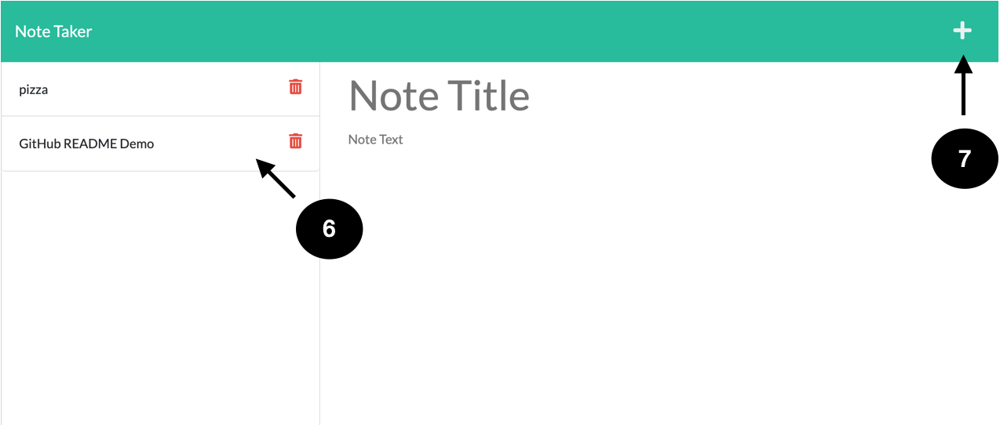

# 11-Note-Tracker-SC

#  Note Tracker

##  Write notes to yourself on Note Tracker. 
### Table of contents
- [Installation](#installation)
- [Usage](#usage)
- [Contributors](#contributors)
- [License](#license)
### Installation
install npm i and npm inquirer 
### Usage
 
1. Press the start button to start adding notes
 
2. Click the Note Taker link to be redirected to the home page 
3. Write your Note's Title here 
4. Then write its description here
 
5. Save your note by clicking the floppy disk icon 
  
6. Your note will be saved to the side with an option to delete 
7. Add another note by clicking the add symbol 

## License
This repository is covered by the MIT License    
https://opensource.org/licenses/MIT
#### Contributors
Damien Luzzo, Ethan Cho.
#### Test Instructions
Jest
##### Questions
If you have any questions please feel free to contact me at cortezstephanie222@yahoo.com  
GitHub: CortezStephanie 

##### Links 
For Demo video please [click here](https://watch.screencastify.com/v/ZOlztKKqO3LGwN5j9AVe).